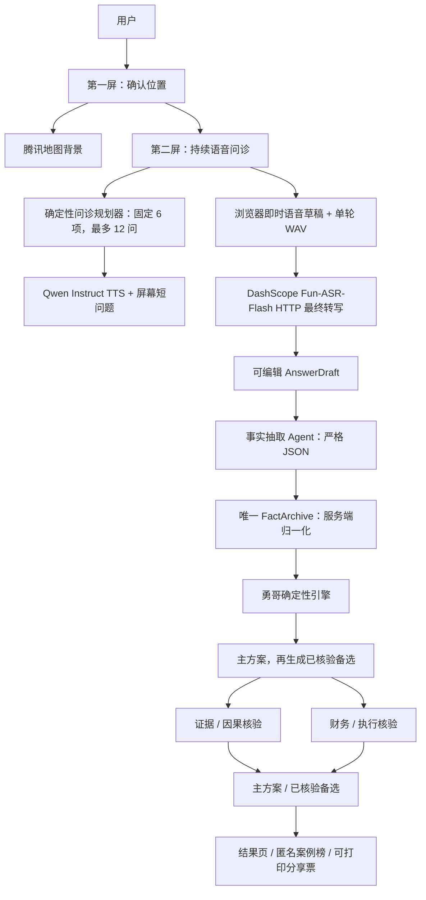
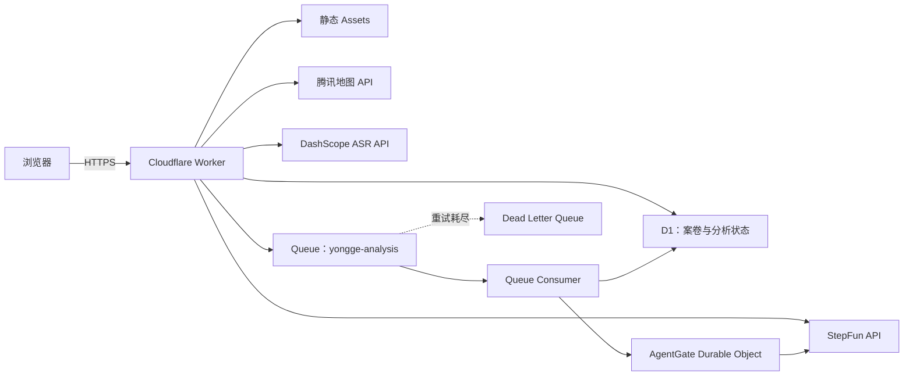

# 店判 2.1 系统架构

## 1. 设计目标

店判解决的不是“缺少餐饮知识”，而是经营者无法把位置、营业、成本、人员、现金和退出条件整理成同一套可验证判断。系统因此遵循四条边界：

1. 用户只负责确认位置、回答短问题和纠正事实，不填写复杂财务表；
2. 数字由确定性程序计算，LLM 不得心算或覆盖结果；
3. Agent 擅长探索方案空间，但每个方案必须能被证据、公式和停止线核验；
4. 证据不足时只输出中文“小步验证”与补证据动作，不把未知包装成结论。

## 2. 端到端数据流



输入部分是三屏，分析结果是独立结果页。用户在位置确认之前不能进入问诊，在事实纠偏完成之前不能开始分析。

## 3. 浏览器交互层

### 3.1 位置屏

用户先选择经营阶段和品类，再通过以下路径之一确认店铺。品类既可直接输入，也提供快餐、小碗菜、面馆、咖啡、火锅和烧烤等快捷选项卡：

1. 浏览器 GPS；
2. 手动输入城市、商圈或详细地址；
3. 准备开店时输入候选地址。

Worker 将 GPS 坐标转换后查询腾讯地图，或解析文字地址，返回行政区、具体地址、附近地标和 800 米内同类 POI。页面把解析结果呈现为一张地址背景卡，必须由用户点击确认；真实店铺入口仍由问诊向用户确认。

定位或地址解析成功后，页面还会显示由 Worker 代理的腾讯静态地图。用户可在图上点击，服务端将这个 GCJ-02 图钉位置反查为最新地址与周边，再由用户确认。地图密钥不会发到浏览器；坐标只保存在浏览器的临时选点状态，提交案卷前会被剥离，D1 不保存原始坐标。

IP 位置只允许预填城市，不返回店铺坐标，也不能直接解锁问诊。地图结果不参与人流、营业额或租金的自动推断。

### 3.2 持续语音问诊屏

用户只点击一次开始。浏览器随后：

- 一次性申请麦克风权限；
- 用 Web Audio 把音频重采样为 16 kHz 单声道；
- 使用客户端能量 VAD 检测用户开始和停止说话；
- 将每轮回答打包为 16-bit WAV，通过案卷 HTTP 接口发送；
- DashScope 返回该段最终转写后，再提交本轮事实抽取；
- 显示当前短问题、问诊进度、转写和暂停/结束按钮。

客户端 VAD 当前保留约 280 ms 前置音频，并以约 350 ms 静音结束一轮；单段最长 20 秒。`fun-asr-flash-2026-06-15` 是整段音频 HTTP 识别模型，不是持续音频 WebSocket。浏览器原生语音识别的中间结果先写入草稿，云端最终转写只会在用户尚未编辑时更新草稿；用户点击“确认并下一题”后才提交。每轮使用唯一 `turnId`，重复或迟到结果不能覆盖新一轮。界面统一显示 `第 X / 12`；问题顺序和上限仍由确定性策略控制：固定 6 项，再按证据需要补问，12 是硬上限；“不知道”立即存为 `unknown`，绝不换句式追问。

问题由一个调度 Agent 负责，不让多个 Agent 同时对用户说话。程序中的 `interview-policy` 决定经营阶段对应的必问字段、字段顺序、每字段最多一问、总轮数和完成条件；Agent 只提取事实与矛盾，并为程序指定字段生成不超过 30 个汉字的口语问题。在线追问调用有 7 秒演示级时限；超时后由确定性策略立即进入下一字段，缺失事实留到全量事实查证页处理。

播报使用 `qwen3-tts-instruct-flash`，固定 `Serena` 音色与“温柔、自然、有专业感的年轻女声”指令。TTS 播放期间麦克风轨道仍保留，但客户端暂停收集用于下一段 ASR 的音频；结束后恢复。因此这是“一次启动、持续会话、轮流说话”，不是多人同声分离，也默认不支持用户打断 AI。

### 3.3 全量事实查证屏

录音停止后，页面把全部待查证事实一次列出，而不是逐张翻页。每项提供三种处理：

- AI 记录正确；
- 我不知道；
- 点击原话框直接编辑。

用户处理完全部项目后只提交一次。编辑后的文字会按事实类型重新解析，不能只改显示文本；系统特别处理周期、毛利/成本率、流水/利润、零值/未回答和区间等口径。查证阶段不再调用 ASR，也不再通过语音重问。

### 3.4 纯演示子域名

`demo.shopvalidator.zhangyvjing.com` 与主站使用同一个 Worker 和静态页面，但浏览器依主机名切换到纯演示状态。它载入已筛选字幕 `BV15vrVBwEVP` 的案例事实：用户点击“获取案例地图信息”后才预填位置；随后每 4 秒逐题展示屏幕问题和字幕回答，不播放 TTS；查证页可点击但不改变档案；点击下一步后固定等待 2 秒，再显示该案例预写的三条低成本实验。

Demo 不调用腾讯地图、ASR、D1 案卷或付费 Agent；没有出现在字幕中的字段保持 `unknown`。它是现场讲解路径，不是对真实门店的分析结果。

### 3.5 准备开店的选址品类排序报告

当用户选择“准备开店 / 接店”且品类为“我不知道”时，结果页不复用已经营业门店的经营诊断卡。它单独呈现三项按优先级排序的候选品类：首选、次选、第三选择。

每个候选必须分别展示：为什么排在该位置、为什么适合、竞争怎么判断、成立前提、先做什么、验证期限/预算/指标、最大风险，以及成功线和停止线。总体解释必须说明 A 为什么在 B 前、B 为什么在 C 前；地图 POI 仅是环境线索，不能被写成人流、营业额或租金。

规则引擎始终提供每个品类不同的竞争、经营与反例字段。若模型生成了更好的文字，会逐字段覆盖；若模型漏字段、只给少于三项或返回空话，规则引擎的差异化字段保留，避免三张不同标题却内容相同的卡片。

## 4. 语音、DashScope 与 StepFun

### 4.1 模型

|职责|模型|调用方式|
|---|---|---|
|问题调度、事实抽取、方案生成与核验、结果解释|`step-3.7-flash`|Worker HTTP，强制 JSON 输出|
|问题播报|`qwen3-tts-instruct-flash`|DashScope HTTP；`Serena` + 指令控制|
|单轮回答转写|`fun-asr-flash-2026-06-15`|DashScope HTTP，完整 WAV Data URI|

`StepFunClient` 只负责文本 Agent，并只在服务端读取 StepFun Key。结构化文本结果为空、截断或 JSON 不合法时会再尝试一次，并要求模型只返回完整 JSON；推理内容不能被当成最终结构化结果。`DashScopeAsrClient` 与 `DashScopeTtsClient` 读取同一个 `DASHSCOPE_API_KEY`，浏览器不能接触任何模型密钥。

### 4.2 音频生命周期

```text
麦克风 PCM（持续采集）
→ 浏览器内存
→ 客户端 VAD 截出单轮 WAV
→ Worker HTTP 内存代理
→ DashScope Fun-ASR-Flash
→ 该轮最终文本
→ 原始音频丢弃
```

应用不把原始音频写入 D1、R2 或日志。持久化的是最终转写、结构化事实、纠偏选择和案卷状态。

### 4.3 语音降级

```text
DashScope ASR
→ 失败：浏览器 SpeechRecognition
→ 再失败或权限拒绝：文字回答

Qwen Instruct TTS
→ 失败：浏览器 speechSynthesis
→ 再失败：始终可见的屏幕文字
```

所有降级路径都保留同一事实纠偏和确定性分析，不因语音不可用而阻塞用户。

## 5. 事实档案

每条事实包含：

```text
事实 ID
值或范围
单位、周期
状态：confirmed / provisional / assumption / unknown / conflict
来源：voice / choice / map / typed / document / calculation
证据等级
原始转写
更新时间
```

案卷整体另有单调递增的版本号，用于让事实纠偏后产生的旧分析立即失效。

核心不变量：

- 未回答与“不知道”不是 0；
- 用户明确回答 0 时可以保留真实零值；
- 范围保持范围，不静默取平均；
- 关键事实未知时不输出精确利润；
- 系统默认值只能是 `assumption`；
- 毛利 45% 可转换为变动成本率 55%，但保留转换来源；
- 用户纠偏会增加案卷版本，旧分析结果被标为 `stale`。

案卷使用随机 Case Token；D1 只保存 Token 的 SHA-256 哈希。服务端案卷读取期限是最后一次写入后 24 小时，过期后不再由 API 返回。`DELETE /api/cases/:id` 提供主动删除。

## 6. 勇哥确定性引擎

`decision-engine.js` 和 `fact-store.js` 不依赖 LLM。当前引擎按保守边界计算：

- 贡献毛利；
- 聚合后的变动成本率；
- 聚合后的固定成本；
- 员工工资和老板/家人的替代工资；
- 月/日保本营业额与保本订单；
- 月经营利润；
- 现金寿命；
- 压力情景。

渠道、人员、产能、采购和租约等事实会进入问诊档案与方案搜索，但当前版本不伪装成已经算出了渠道单位经济或人均产出。

输出状态为：

|状态|含义|
|---|---|
|`EVIDENCE`|关键事实不足或互相冲突，先补证据|
|`GO`|单位经济和现金约束允许按方案继续|
|`TEST`|只做可逆、低预算、能证伪的实验|
|`STOP`|停止继续投入或扩张，先止损|
|`EXIT`|确认处于亏损且现金寿命不足 3 个月，优先准备退出|

最终写作 Agent 只能读取既定的引擎结果和 Top 方案进行解释，不能修改公式结果、已经完成的排名、风险或停止线。

## 7. 3 条并行方案流水线

### 7.1 搜索结构

目标是让 3 条独立流水线各生成一个不同机制的候选并完成审计。系统只运行这一轮，不再迭代搜索 10 条或 20 条方案：

```text
3 个生成调用并发
→ 程序硬规则核验
→ 3 个证据/因果核验调用并发
→ 3 个财务/执行核验调用并发
→ 去重并保存最多 3 个通过方案
```

每个进入审计的候选都有两个独立核验结果，总计最多 9 次核心 Agent 调用，全局并发不超过 3。若生成 Agent 技术失败、JSON 畸形、方案重复或未过硬门槛，系统使用零预算、可逆、只补证据的安全任务补位，并在 `origin` 和 `degradations` 中显式记录，不把它伪装成正常生成结果。若核验 Agent 仅发生技术或结构失败，只有通过全部程序硬门槛的低风险任务才能以低置信度保留，评分封顶 65；明确的业务否决不会被覆盖。

### 7.2 硬核验

程序会直接淘汰：

- 没有引用案卷事实；
- 把地图 POI 当成真实人流；
- 单次预算超过保守现金下界 20%，期限超过现金寿命，或 `expected_effect` 的收入、成本与利润增量算术不一致；
- 没有预算、期限、指标、成功线或停止线；
- 把未知写成已确认事实；
- 证据不足却建议加盟、签约或大额装修；
- 现金不足却建议不可逆投入；
- 单位经济为负却先扩大流量；
- 没有岗位和产能证据却建议裁掉具体员工。

评分由证据追溯、第一断点、因果/反事实、经营影响、资本安全/可逆、可测量和可执行组成。最终按“作用对象 + 因果机制 + 成功指标”去重，只保留最多 3 个不同机制；没有三个合格方案时不补齐。

## 8. Cloudflare 运行架构



### 8.1 Worker

Worker 负责：

- 静态站点；
- 腾讯地图服务端代理；
- Qwen Instruct TTS HTTP 代理与 DashScope 单段 WAV HTTP 代理；
- 案卷鉴权、同源检查和限流；
- 问诊轮次与事实版本；
- 分析任务创建、进度读取、方案选择和案卷删除。

### 8.2 D1

D1 保存案卷快照、转写/事实、案卷版本、分析任务、单轮搜索状态、核验结果、拒绝理由和最终 1–3 个方案。Queue 在单轮完成后持久化结果，Worker 重启不会丢失已经完成的审计。

### 8.3 Queue 与 DLQ

生产分析使用 `yongge-analysis`。每条消息处理唯一一轮，消费者批大小和并发都限制为 1。该轮有领取锁和轮次检查，用于抵御重复投递；失败消息按配置重试，重试耗尽后进入 `yongge-analysis-dlq`，不会静默丢失。

### 8.4 AgentGate Durable Object

所有 `step-3.7-flash` 文本模型调用经过同一个命名的 `AgentGate` Durable Object。它把全局活跃调用严格限制在 5 个，并串行维护限流桶；当前三条方案流水线自身的并发上限仍是 3。Queue 串行推进分析任务，单轮内部仍能并发生成或核验。

## 9. API 边界

```text
POST   /api/cases
POST   /api/cases/:id/location
POST   /api/cases/:id/asr
POST   /api/cases/:id/turns
POST   /api/cases/:id/review
POST   /api/cases/:id/analyze
GET    /api/cases/:id/runs/:runId
GET    /api/cases/:id/runs/:runId/events
POST   /api/cases/:id/plans/:planId/start
DELETE /api/cases/:id

GET    /api/map/context
GET    /api/map/address-context
GET    /api/map/ip-location
POST   /api/tts
```

客户端不能指定模型名、模型 Base URL、系统提示词或服务端密钥。

## 10. 故障与降级矩阵

|故障|系统行为|
|---|---|
|GPS 拒绝或超时|IP 仅预填城市，要求用户输入并确认详细地址|
|腾讯地图失败或未配置|接受用户确认的文字位置，明确标注地图未参与|
|麦克风拒绝|直接切换文字问诊|
|DashScope ASR 失败|浏览器语音识别，再失败则文字问诊|
|Qwen Instruct TTS 失败|浏览器播报；至少保留屏幕问题|
|问题调度模型失败|固定问题库继续覆盖经营维度|
|Agent 方案搜索失败|保留确定性判断并输出低成本补证据方案|
|Queue 单轮失败|自动重试；耗尽后进入 DLQ|
|客户端等待超时|显示本地确定性降级，不伪装云端 Agent 已完成|
|关键数字未知或冲突|输出 `EVIDENCE`，不产生精确利润|

机械判断始终先于 Agent 搜索，因此模型、地图或语音服务不可用时，系统仍能基于用户确认事实给出保守的决策状态。

## 11. 测试层次

|层次|入口|覆盖|
|---|---|---|
|事实档案|`node test_fact_store.js`|未知、零值、范围、周期、毛利转换、版本历史|
|确定性引擎|`node test_decision_engine.js`|决策闸门、保守计算、关键事实不足|
|问诊策略|`node test_interview_policy.js`|阶段必问字段、两次拆问、30 轮上限、短问题|
|服务端适配|`node test_server_decision_adapter.mjs`|忽略客户端计算、服务端重算与完整性判定|
|StepFun 文本客户端|`node test_stepfun_client.mjs`|结构化输出与重试|
|DashScope ASR 客户端|`node test_dashscope_asr_client.mjs`|鉴权、WAV Data URI、请求格式与响应解析|
|DashScope TTS 客户端|`node test_dashscope_tts_client.mjs`|指令、Serena 音色、鉴权与音频解码|
|Agent 搜索|`node test_agent_orchestrator.js`|3 候选、每个双核验、并发不超过 3、硬上限 3|
|Worker|`node test_worker.mjs`|地图、案卷、鉴权、单轮 WAV ASR、AgentGate|
|浏览器 E2E|`python test_location_e2e.py`|位置、一次启动、降级、全量查证、一次提交、数字口径与选址三品类排序页|
|真实 StepFun 文本|`node test_stepfun_live.mjs`|真实 JSON 文本调用|
|真实腾讯地图|`node test_worker_live.mjs`|真实地址与周边接口|
|生产 ASR 冒烟|`node test_production_asr.mjs`|真实 Worker Secret、二进制 WAV 上传与 Fun-ASR-Flash 返回|
|生产全链路|`python test_production_e2e.py --confirm-paid-analysis`|生产静态页、地图、TTS、事实纠偏、付费 3 方案搜索、方案执行与删除|

所有 Python 命令在本工作区使用 `pyenv shell Agent`。

完整分析不设每日或按公网 IP 的次数上限。单段 ASR 音频上限为 3 MiB，ASR 接口另设每小时限流；每个案卷最多调用 40 次 TTS。后两项是单案卷与传输安全边界，不影响用户跨日继续完整分析。

## 12. 部署边界

首次部署必须先创建 D1、生产 Queue、DLQ 和 Durable Object 迁移所需的 Worker 绑定，再应用 `schema.sql`、写入 Worker Secrets、执行 Dry Run，最后部署。日常部署由 `./deploy.sh` 运行静态检查、单元测试、公开资产构建、Wrangler Dry Run 和正式发布。

`build_site.py` 只把 `index.html`、样式、前端事实/决策代码、应用代码和聚合后的公开数据复制到 `dist/`。研究文档、测试、原始字幕、分析代码、数据库内容和密钥不会作为静态资产公开。

具体命令见 [README.md](README.md)。研究与产品判断依据见 [FIRST_PRINCIPLES_REPORT.md](FIRST_PRINCIPLES_REPORT.md)、[RESEARCH.md](RESEARCH.md) 和 [YONGGE_DECISION_TREE.md](YONGGE_DECISION_TREE.md)。
