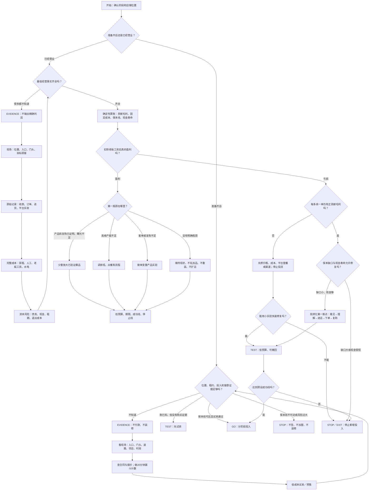

# 勇哥餐饮判断决策树

这不是把勇哥每句话机械复制成规则，而是把已筛选字幕中反复出现的判断顺序，整理成可由“店判”执行的决策框架。

核心原则：

> 不知道时先补最小证据；知道后先算账；赚钱时只优化第一瓶颈；亏损时先区分单位经济问题与固定成本问题；无法低成本修复时止损。

## 四种典型入口

|用户状态|勇哥式处理|明确不做|
|---|---|---|
|什么都不知道|先看现场，并把大问题拆成能查、能数的小事实：流水、订单、进货、平台实收、租金、人工、现金|不随便估数字；不直接建议投流、换品牌、重装|
|数据基本完整|先算真实利润、保本线和现金寿命，再定位转化链的第一断点|不以营业额代替利润，不同时改很多变量|
|经营良好|先确认利润已计老板工资；保护已验证的产品和复购，只放大最窄瓶颈|不默认加品、扩店或重装修|
|经营较差|先分清“单笔经济为负”还是“单笔挣钱但固定成本过高”；可修复就做小实验，不可修复就止损|不先靠更多流量掩盖亏损|

## “什么都不知道，就去看看店”是否正确

方向正确，但不完整。勇哥式的“看”至少有三种：

1. **看物理现场**：城市、商圈、入口、道路、门头、邻店与营业时段；
2. **看原始记录**：收款、订单、进货、平台实收、合同和工资；
3. **看真实行为**：经过、目标顾客、看见、进店、下单与复购。

因此系统不应在未知时输出一个精确经营方案，而应选择最便宜、最能改变下一步判断的补证据任务。证据补齐前，默认停止签约、加盟、装修和长期投流等不可逆动作。

## 语料依据

- [FIRST_PRINCIPLES_REPORT.md](FIRST_PRINCIPLES_REPORT.md) 的高可信样本统计显示，156 份经营案例中，当前营业额覆盖 89.7%，面积房租覆盖 95.5%，店外门头覆盖 79.5%。这说明“现场 + 经营结果 + 成本”是稳定的早期问诊维度。
- `BV1kHZuBGE4E` 汉堡店：经营者不知道毛利，勇哥把问题拆成进货额、销售额及油等成本分摊，先要求算清毛利再谈增长。
- `BV1gc6TBTELz` 糯米饭：经营者既不知道毛利，也不了解周边同行；判断同时转向现场、债务及失败后的偿还能力。
- `BV13kzZB7EB5` 合伙店：投资者不知道具体流水，勇哥改问总销售、总投入和合伙控制关系；“不知道”本身成为治理风险。
- `BV1D1T96dEZN` 烤鱼店：产品、复购和利润已被订单证明后，判断瓶颈为偏僻位置造成的曝光不足，于是只建议小规模本地推广，并避免乱加品。

## 与产品规则的边界

- “先看现场、先把毛利算清、早问房租人工、明显亏损时比较退出”有直接语料支持。
- `EVIDENCE / GO / TEST / STOP / EXIT`、20 分钟漏斗、预算上限和明确停止线，是店判对上述方法的程序化表达，不是勇哥在每条视频中逐字使用的固定术语。
